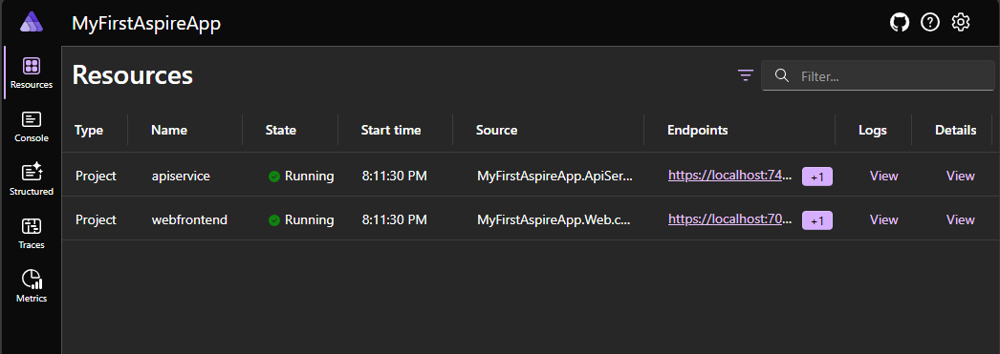
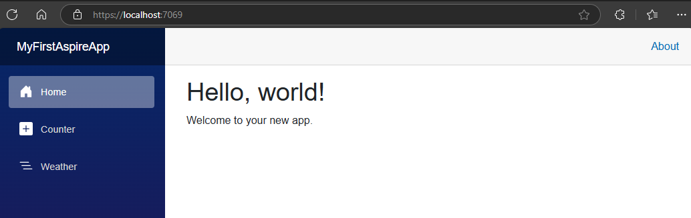

# Part 1 - The Basics

Let's start by creating a new .NET aspire by executing:

> dotnet new aspire-starter -n MyFirstAspireApp

I'm using the `-n` flag to give the project a name, otherwise it takes the name of the directory, 
which in this case is quite ugly.

This command creates quite a lot of code:

1. `MyFirstAspireApp.AppHost`: the "orchestration" project that.. orchestrates stuff? I'm sure we'll learn more
about this later.
1. `MyFirstAspireApp.ServiceDefaults`: the project that contains the configuration for all the applications.
1. `MyFirstAspireApp.ApiService`: a web api that exposes a service to query weather data.
1. `MyFirstAspireApp.Web`: a Blazore WebAssembly application that is the UI for a weather application.

Let's see this run:

> cd MyFirstAspireApp.AppHost
> dotnet run

Since the `AppHost` project is dependent on the other projects, this builds everything and runs the application. In the
console, we can see some traces and also information on how to login to the application dashboard:

```
info: Aspire.Hosting.DistributedApplication[0]
      Aspire version: 8.2.2+5fa9337a84a52e9bd185d04d156eccbdcf592f74
info: Aspire.Hosting.DistributedApplication[0]
      Distributed application starting.
info: Aspire.Hosting.DistributedApplication[0]
      Application host directory is: <redacted>\learning-dotnet-aspire>\Part1-TheBasics\MyFirstAspireApp.AppHost
info: Aspire.Hosting.DistributedApplication[0]
      Now listening on: https://localhost:17299
info: Aspire.Hosting.DistributedApplication[0]
      Login to the dashboard at https://localhost:17299/login?t=c8cd13362afa4b22cc49b897792d9a4f
info: Aspire.Hosting.DistributedApplication[0]
      Distributed application started. Press Ctrl+C to shut down.
```

Navigating to the login dashboard we get a very nice page where we can see a lot of information:



I think a full tutorias is needed only for this dashboard. For now, I'll click on the URL of the `webfrontend` resource
to navigate to the web app that was created.



The app has a counter which can be incremented, and a weather page that shows data fetched from the weather
api that is also part of the project.

To get our hands a bit dirty, lets see if we can change the code so the `Summary` of the weather
is related to the temperature, and not random (I'm getting -10C Warm, which doesn't make sense). The code for this is
in the `Program.cs` file in the `ApiService` project. I'm replacing this code:

```csharp
var summaries = new[]
{
    "Freezing", "Bracing", "Chilly", "Cool", "Mild", "Warm", "Balmy", "Hot", "Sweltering", "Scorching"
};

app.MapGet("/weatherforecast", () =>
{
    var forecast = Enumerable.Range(1, 5).Select(index =>
        new WeatherForecast
        (
            DateOnly.FromDateTime(DateTime.Now.AddDays(index)),
            Random.Shared.Next(-20, 55),
            summaries[Random.Shared.Next(summaries.Length)]
        ))
        .ToArray();
    return forecast;
});
```

With this code:

```csharp
string Summary(int forecast) => forecast switch
{
    <= 0            => "Freezing",
    > 0 and <= 10   => "Cool",
    > 10 and <= 20  => "Mild",
    > 20 and <= 30  => "Warm",
    > 30            => "Scorching"
};

WeatherForecast GenerateForecast(int index)
{
    var temperature = Random.Shared.Next(-20, 55);
    return new
    (
        DateOnly.FromDateTime(DateTime.Now.AddDays(index)),
        temperature,
        Summary(temperature)
    );
}

app.MapGet("/weatherforecast", () =>
{
    var forecast = Enumerable.Range(1, 5).Select(index => GenerateForecast(index)).ToArray();
    return forecast;
});
```

Restarting the app, and there we go - the summary now makes sense 🎉.

This is enough for today. There is a LOT to cover going forward, and I'm going to try and take it step by step, trying to understand
all the components that make up this huge beast called Aspire.

Happy Coding!


