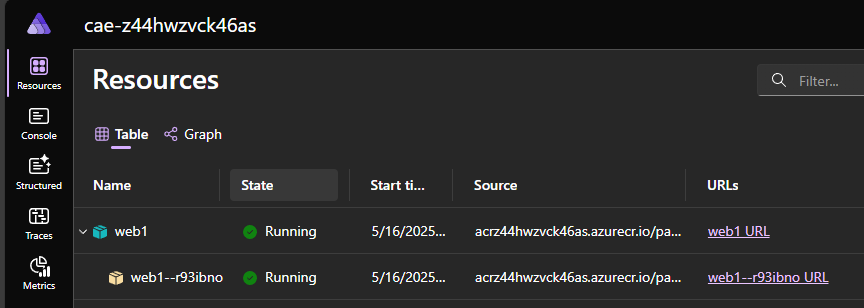
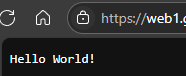

# Part 3 - Deploying the Simple Web App

In the previous tutorial we created a simple web app using .NET Aspire. Now we will
see how to deploy it to Azure

The simplest way to do this is to deploy to Azure Container Apps, which is a managed
solution to run containerized applications. This is the simplest deployment path so
we'll start with it. The process is very simple using the 
[Azure Developer CLI (azd)](https://learn.microsoft.com/en-us/azure/developer/azure-developer-cli/).

First, init the azure development environment:

`> azd init`

This commands scans the directory where it runs for instances of aspire app hosts. Detecting the
one we have, it asks if we want to continue:

```
Initializing an app to run on Azure (azd init)

? How do you want to initialize your app? Use code in the current directory

  (✓) Done: Scanning app code in current directory

Detected services:

  .NET (Aspire)
  Detected in: <redacted>\Part3-DeploySimpleWebApp\src\SimpleApp-AppHost\SimpleApp-AppHost.csproj    

azd will generate the files necessary to host your app on Azure.
? Select an option  [Use arrows to move, type to filter]
> Confirm and continue initializing my app
  Cancel and exit
```

I select to continue and now I'm asked for a unique name for the environment. This affects the name of the
resource group that is created in Azure, the unique suffix that is given to all resources (using a hash), and
the text on the tag that is added to all resource groups used by the environment.

```
? Enter a unique environment name: Vainolo-Aspire-Part3

Generating files to run your app on Azure:

  (✓) Done: Generating ./azure.yaml
  (✓) Done: Generating ./next-steps.md

SUCCESS: Your app is ready for the cloud!
You can provision and deploy your app to Azure by running the azd up command in this directory. For more information on configuring your app, see ./next-steps.md
```

After the project has been configured, we can deploy the app to azure in one command:

`> azd up`

I'm asked to enter the subscription I want to use from the subscriptions the command can fins:

```
? Select an Azure Subscription to use:  [Use arrows to move, type to filter]
>  1. <redacted> (<redacted>)
```

Then the location for the deployment (this probably changes based on where you are located and the capacity
of azure, but that is just a guess):

```
? Enter a value for the 'location' infrastructure parameter:  [Use arrows to move, type to filter]
  53. (US) West US (westus)
  54. (US) West US 2 (westus2)
> 55. (US) West US 3 (westus3)
```

And here we go!

```
Packaging services (azd package)


Provisioning Azure resources (azd provision)
Provisioning Azure resources can take some time.

Subscription: <redacted> (<redacted>)
Location: West US 3

  You can view detailed progress in the Azure Portal:
  https://<redacted>

  (✓) Done: Resource group: rg-Vainolo-Aspire-Part3 (3.467s)
  (✓) Done: Container Registry: acrz44hwzvck46as (15.744s)
  (✓) Done: Log Analytics workspace: law-z44hwzvck46as (19.271s)
  (✓) Done: Container Apps Environment: cae-z44hwzvck46as (2m16.714s)

Deploying services (azd deploy)

  (x) Failed: Deploying service Web1

ERROR: error executing step command 'deploy --all': failed deploying service 'Web1': updating container app service: applying manifest: PUT https://<redacted>
--------------------------------------------------------------------------------
RESPONSE 400: 400 Bad Request
ERROR CODE: ContainerAppInvalidName
--------------------------------------------------------------------------------
{
  "error": {
    "code": "ContainerAppInvalidName",
    "message": "Invalid ContainerApp name 'Web1'. A name must consist of lower case alphanumeric characters or '-', start with an alphabetic character, and end with an alphanumeric character and cannot have '--'. The length must be between 2 and 32 characters inclusive."
  }
}
--------------------------------------------------------------------------------

TraceID: 5459bdbc77f6a12c75cd588bd0de35a5
```

I'm going to admit that fixing this took me waaaaay longer than expected because it was not clear which instance 
of `Web1` was causing the issue. I was convinced that it had something to do with the names of the `SimpleApp-Web1`
so much that I missed that `Web1` was also the name I gave the application in the host code 🤦‍♂️🤦‍♂️🤦‍♂️.

Changing `Web1` to `web1` in the `Program.cs` file of the `SimpleApp-AppHost` fixed the issue 👍.

```
Packaging services (azd package)


Provisioning Azure resources (azd provision)
Provisioning Azure resources can take some time.

Subscription: <redacted> (<redacted>)
Location: West US 3

  (-) Skipped: Didn't find new changes.

Deploying services (azd deploy)

  (✓) Done: Deploying service web1
  - Endpoint: https://web1.<redacted>.westus3.azurecontainerapps.io/

  Aspire Dashboard: https://aspire-dashboard.ext.<redacted>.westus3.azurecontainerapps.io

SUCCESS: Your up workflow to provision and deploy to Azure completed in 45 seconds.
```

Dashboard is up and running:



And the app also works:



Now for a very important part of this tutorial: removing the test app. Cloud resources can be
pretty pricey and usage is charged by the second. The Aspire team did this the right way, with a single
command to remove the whole environment:

```
> azd down

Deleting all resources and deployed code on Azure (azd down)
Local application code is not deleted when running 'azd down'.

  Resource(s) to be deleted:

  Resource Group: rg-Vainolo-Aspire-Part3
    • Log Analytics workspace: law-z44hwzvck46as
    • Container Registry: acrz44hwzvck46as
    • Container Apps Environment: cae-z44hwzvck46as
    • Container App: web1

? Total resources to delete: 6, are you sure you want to continue? Yes
Deleting your resources can take some time.e you want to continue? (y/N) y

  (✓) Done: Deleted resource group rg-Vainolo-Aspire-Part3


SUCCESS: Your application was removed from Azure in 18 minutes 4 seconds.
```

Cool 😎.

Next time, a drill down into the deployment process, what is created, and how it can be changed. Or maybe
something else. Time will tell.

As always the code for this tutorial (and all other tutorials) can be found on GitHub. Until next
time, happy coding!