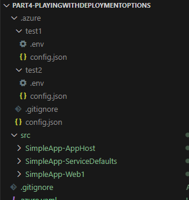

# Part 4 - Playing with Deployment Options

In the previous tutorial we deployed our app to Azure with the default settings, which deploy to
[Azure Container Apps](https://learn.microsoft.com/en-us/azure/container-apps/) with names that are
randomly generated, and adding tags to the resources so they can be identified.

I was going to spend some time investigating what can be configured in this process, but I've
decided this is not a good investment of my time, so I'm just going to do a short tutorial on
useful commands from `azd` (Azure Developer CLI). I'm a big fan of using the command line for automation, without any
prompts, questions, clicks, or selections. One script/command should do everything end to end.
Full documentation of the tool can be found 
[here](https://learn.microsoft.com/en-us/azure/developer/azure-developer-cli/reference).

To create an Aspire environment without interaction, we need to provide it some defaults:

```ps
azd init --no-prompt --from-code --environment test1 --subscription <SubscriptionId> --location northeurope
```

This will create an environment named `test1`, that will be deployed to subscription `<SubscriptionId>`,
in the `northeurope` region. To deploy the environment without any interaction:

```ps
azd up --no-prompt
```

And delete the deployed resources of an environment:

```ps
azd down --environment test1 --force
```

But wait, what is an Aspire environment? Yeah, we didn't cover this before! An environment defines a set of properties
that affect how the project is deployed. For example, you can create different environments for dev/test/prod, or for
big projects, multiple prod deployments to different regions. The information about each environment
is stored under the `.azure` directory.

Let's create another environment called `test2`, which is deployed to `eastus`:

```ps
azd env new test2 --subscription <SubscriptionId> --location eastus
```

This is how it would look on the explorer:



When a new environment is created it is also set as the default environment (which is stored in the `config.json` file in 
the `.azure` directory). So running any `azd` command will use the settings of that environment.

To override the default environment, it can be passed on explicitly. For example:

```ps
azd up --no-prompt --environment test1
```

Or we can select which environment is the default one:

```ps
azd env select test1
```

All environments can be fecht by running:

```ps
azd env list
```

I think this is good enough for now. There are many other commands in `azd` which I'll cover when I find them
useful. For a complete reference, check the [AZD command reference](https://learn.microsoft.com/en-us/azure/developer/azure-developer-cli/reference).

As always the code for this tutorial (and all other tutorials) can be found on GitHub. Until next
time, happy coding!