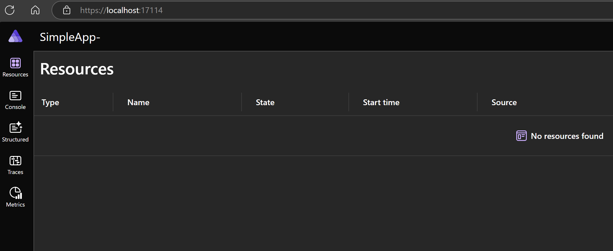

# Part 2 - starting form scratch

To really learn something we need to start from scratch.

First, create a new app host:

```
> dotnet new aspire-apphost -n SimpleApp-AppHost
```

This creates the "orchestrator" of the apps. This can run, will not do much, but does run:

```
> cd SimpleApp-AppHost
> dotnet run
Using launch settings from <redacted>\src\SimpleApp-AppHost\Properties\launchSettings.json...
Building...
info: Aspire.Hosting.DistributedApplication[0]
      Aspire version: 8.2.2+5fa9337a84a52e9bd185d04d156eccbdcf592f74
info: Aspire.Hosting.DistributedApplication[0]
      Distributed application starting.
info: Aspire.Hosting.DistributedApplication[0]
      Application host directory is: <redacted>\src\SimpleApp-AppHost
info: Aspire.Hosting.DistributedApplication[0]
      Now listening on: https://localhost:17114
info: Aspire.Hosting.DistributedApplication[0]
      Login to the dashboard at https://localhost:17114/login?t=f3f0cf47ebc34c01d5214c2eb0d5cd18
info: Aspire.Hosting.DistributedApplication[0]
      Distributed application started. Press Ctrl+C to shut down.
```

Adn we can navigate to the dashboard, which is completely empty, but works nonetheless.



Let's add a new web application to this host:

