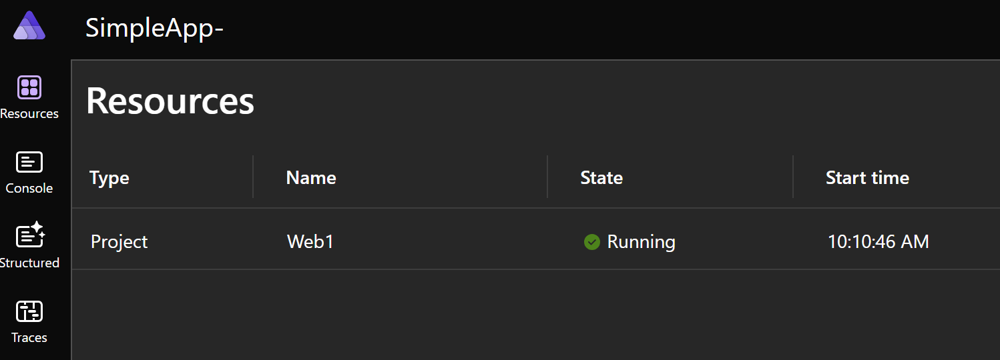
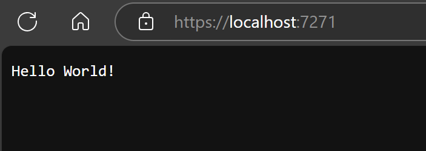

# Part 2 - starting form scratch

In the previous Aspire post, we took a look at the basic sample Aspire web app works. This time, we'll create
a new app from scratch to get a better understanding of the basic building blocks of Aspire.

First, we create a new Aspire AppHost:

```
> dotnet new aspire-apphost -n SimpleApp-AppHost
```

The AppHost is the manager/orchestrator of the distributed application that we are building using the Aspire framework. Since it is an executable application, we can run it. It will not do much, but does run:

```
> cd SimpleApp-AppHost
> dotnet run
Using launch settings from <redacted>\src\SimpleApp-AppHost\Properties\launchSettings.json...
Building...
info: Aspire.Hosting.DistributedApplication[0]
      Aspire version: 8.2.2+5fa9337a84a52e9bd185d04d156eccbdcf592f74
info: Aspire.Hosting.DistributedApplication[0]
      Distributed application starting.
info: Aspire.Hosting.DistributedApplication[0]
      Application host directory is: <redacted>\src\SimpleApp-AppHost
info: Aspire.Hosting.DistributedApplication[0]
      Now listening on: https://localhost:17114
info: Aspire.Hosting.DistributedApplication[0]
      Login to the dashboard at https://localhost:17114/login?t=f3f0cf47ebc34c01d5214c2eb0d5cd18
info: Aspire.Hosting.DistributedApplication[0]
      Distributed application started. Press Ctrl+C to shut down.
```

We can navigate to the dashboard, which is completely empty. But for me, working things are comforting,
so this is good :-).


Turns out that adding a new application is not complicated at all. First thing that we need is to create
the service defaults project, which is the project that defines the shared settings and configurations
for all the applications that will run with the same host. This is easily done:

> dotnet new aspire-servicedefaults -n SimpleApp-ServiceDefaults

And while we are creating things, we will also create our web application:

> dotnet new web -n SimpleApp-Web1

There are a couple of "wires" that need to be connected so that these three projects (settings,
host, app) are aware of each other and work together. Applications that run with the host must
reference the same service defaults project, and the host needs to reference the applications. Adding
these references is simple. First, we'll add a reference from the web app to the service defaults project.

> dotnet add .\SimpleApp-Web1\SimpleApp-Web1.csproj reference .\SimpleApp-ServiceDefaults\SimpleApp-ServiceDefaults.csproj

And then a reference from the host to the web app project

> dotnet add .\SimpleApp-AppHost\SimpleApp-AppHost.csproj reference .\SimpleApp-Web1\SimpleApp-Web1.csproj

Two small code changes are needed. First, we add the service defaults configuration to our web 
app so it has the necessary services that are used to run on the Aspire host. We add this on the
`Program.cs` file of the web app just after creating the builder.:

```
var builder = WebApplication.CreateBuilder(args);
builder.AddServiceDefaults();
```

Finally the app project is added to the host builder so the host executes it. This is done in
the `Program.cs` file of the app host project after creating the builder (promise next time to give better names to these files):

```
var builder = DistributedApplication.CreateBuilder(args);
builder.AddProject<Projects.SimpleApp_Web1>("Web1").WithExternalHttpEndpoints();
```

If you read the previous change carefully, you will see that the name of the project
is `SimpleApp_Web1` and not `SimpleApp-Web1` as the actual name of the project. This is because
`C#` identifiers (and pretty sure most programming languages) don't allow `-` as an identifier. Something
to take into consideration when naming projects in the future.

Let's run the host to see the results.

```
> dotnet run --project .\SimpleApp-AppHost\SimpleApp-AppHost.csproj
Using launch settings from .\SimpleApp-AppHost\Properties\launchSettings.json...
Building...
info: Aspire.Hosting.DistributedApplication[0]
      Aspire version: 8.2.2+5fa9337a84a52e9bd185d04d156eccbdcf592f74
info: Aspire.Hosting.DistributedApplication[0]
      Distributed application starting.
info: Aspire.Hosting.DistributedApplication[0]
      Application host directory is: C:\dev\personal-repos\learning-dotnet-aspire\part2-SimpleWebApp\src\SimpleApp-AppHost
info: Aspire.Hosting.DistributedApplication[0]
      Now listening on: https://localhost:17114
info: Aspire.Hosting.DistributedApplication[0]
      Login to the dashboard at https://localhost:17114/login?t=6e00479dd713c387209238f98db39b32
info: Aspire.Hosting.DistributedApplication[0]
      Distributed application started. Press Ctrl+C to shut down.
```

Great, works! We can navigate to the dashboard, and we see that the app shows up:



Last check, click on the link to the app... it works!



Thats all I have for today. The process was straightforward, which encourages me to continue
investigating Aspire. Next time, I'll learn how to deploy the application to Azure (the simplest)
method, and from there, who know where the path will take me.

You can find the code for this tutorial on my GitHub repo.

Until next time, happy coding!